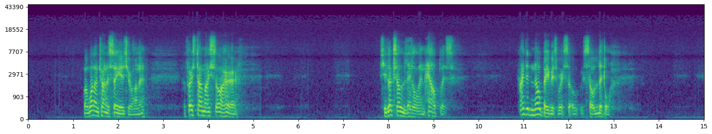
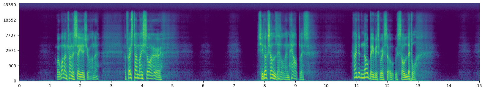

<h1> High-Resolution Speech Restoration with Latent Diffusion Model </h1>

Tushar Dhyani<sup>1,2</sup>, Florian Lux<sup>2</sup>, Michele Mancusi<sup>1</sup>, Giorgio Fabbro<sup>1</sup>, Fritz Hohl<sup>1</sup>, Ngoc Thang Vu<sup>2</sup><br> 
<sup>1</sup>Sony Europe B.V., Stuttgart, Germany<br>
<sup>2</sup>University of Stuttgart, Germany<br>
</div>

Welcome to the supplementary page of our paper _High-Resolution Speech Restoration with Latent Diffusion Model_. You can read the paper on [Arxiv]().

This page contains one real-world sample where we compare the performance with other publically available speech-restoration frameworks compared in the paper. 

---

## Abstract
Traditional speech enhancement methods often oversimplify the task of restoration by focusing on a single type of distortion. Generative models that handle multiple distortions frequently struggle with
phone reconstruction and high-frequency harmonics, leading to breathing and gasping artifacts that reduce the intelligibility of reconstructed speech. These models are also computationally demanding, and many solutions are restricted to producing outputs in the wide-band frequency range, which limits their suitability for professional applications. To address these challenges, we propose Hi-ResLDM, a novel generative model based on latent diffusion designed to remove multiple distortions and restore speech recordings to studio quality, sampled at 48kHz. We benchmark Hi-ResLDM against state-of-the-art methods that leverage GAN and Conditional Flow Matching (CFM) components, demonstrating superior performance in regenerating high-frequency-band details. Hi-ResLDM not only excels in non-instrusive metrics but is also consistently preferred in human evaluation and performs competitively on intrusive evaluations, making it ideal for high-resolution speech restoration.

The link below redirects to the video on Youtube.

[](https://www.youtube.com/watch?v=KLXGM_EQbDQ)

---






## Cite
```bibtex
@misc{dhyani2024highresolutionspeechrestorationlatent,
      title={High-Resolution Speech Restoration with Latent Diffusion Model}, 
      author={Tushar Dhyani and Florian Lux and Michele Mancusi and Giorgio Fabbro and Fritz Hohl and Ngoc Thang Vu},
      booktitle={IEEE International Conference on Acoustics, Speech, and Signal Processing (ICASSP)},
      year={2025},
      eprint={2409.11145},
      archivePrefix={arXiv},
      primaryClass={cs.SD},
      url={https://arxiv.org/abs/2409.11145}, 
}
```

## Examples across different domains. 

## Samples from our evaluation set

### Deonising
### Dereveberation
### Expressivity
### Low-pass